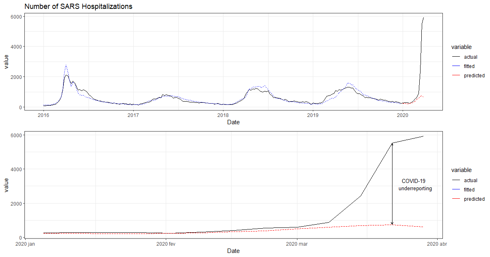

# Estimating COVID-19 underreporting 

    
    
Estimated COVID-19 underreporting

## About
The goal of this project is to estimate the number of COVID-19 cases underreported by the Brazilian Federal Government. To do this, a prediction of the number of COVID-19 seveare cases is made using hospitalization data. The project consisted of the following steps:

- Collect hospitalization data;
- Create a model to predict the number of future hospitalizations;
- Use the model predictions as a counterfactual to the number of COVID-19 reported cases.

## Tools used:
- Python (pyautogui, time, pandas)
- R (dplyr, sf, ggplor2, cowplot, ggspatial)

### 1. Collecting data
Hospitalization data was collected from [Fiocruz](http://info.gripe.fiocruz.br/), using Python library pyautogui. Data cosists of two main variables:
- Number of hospitalizations due to Seveare Acute Respiratory Syndrom (SARS)
- Number of SARS hospitalizations of patients diagnosed with Flu.

The number of COVID-19 cases was download from [this Kaggle contributer](https://www.kaggle.com/unanimad/corona-virus-brazil).

All variables were aggregated by week. 

### 2. Predicting the number of future hospitalizations
If no health crises is in place, the number of SARS hospitalizations due to Flu is a greate predictor to the total number of SARS hospitalization. Another thing to notice is that there is a seasonality in the number cases, probably related to climate. Considering the nature of the variable (count), a Generalized Linear Model is used, considering the Poisson distribution. In this model it is included the covariate Flu and Structural Time Series variables (trend and seasonality). Only data before the first confirmed COVID-19 case is used to fit the model. 

### 3. Estimating COVID-19 underreporting
With a model to predict SARS hospitalizations at hand, we can see what would be the number of hospitalization if the COVID-19 crises had not occurred. This is a counterfactual to the actual number of SARS hospitalization post COVID-19 pandemic, and thus can be used to predict the impact that the pandemic had on SARS hospitalization. 
This impact is also a crude estimative of the number of seveare COVID-19 cases, and can be compared to the actual reported number, considering that most tests that are made, are in people with seveare cases (at least it was like this in the beginning of the pandemic in Brazil).

## Extension
The analysis was also made disagreggated by state. The results are summarised in my [Kaggle Notebook](https://www.kaggle.com/ianfukushima/estimate-covid-19-based-on-sars-hospitalizations), with the code used in the middle! Check it out.

## About me
**Made with ❤️ by Ian Fukushima | [LinkedIn](https://linkedin.com/in/ian-fukushima) | [GitHub](https://github.com/is-fuku)**

